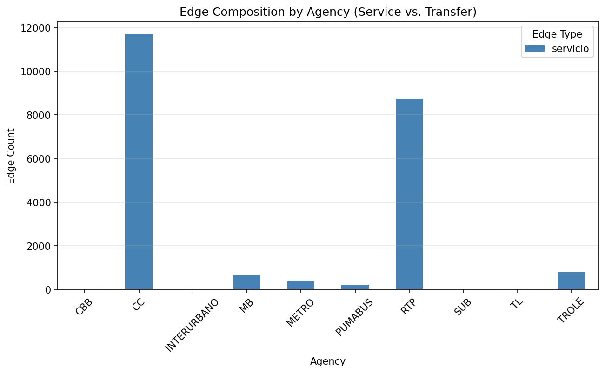
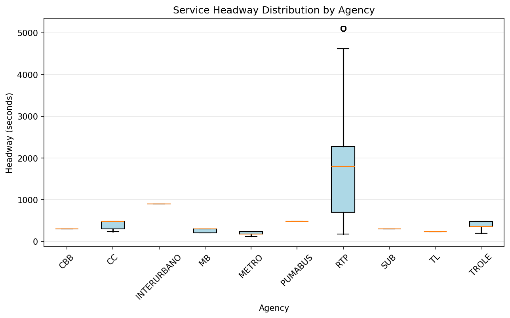

# CDMX Transit Resilience

Multiplex graph of Mexico City's mobility system (Metro, Metrobús,
Trolebús, RTP, Corredores Concesionados, Cablebús, Pumabús, Tren Ligero,
Suburbano, Tren Interurbano) built from GTFS data, to study:

1. **Dynamic resilience and cascading failure propagation** (Motter & Lai
   style load-capacity model, with Buldyrev et al. style inter-layer
   coupling).
2. **Peak-hour passenger flow** modeled as a biased random walk over the
   graph (Fronczak & Fronczak; Noh & Rieger), using service frequency as
   a proxy for capacity/flow.

This README covers the **Phase 0–4 completion**: ingestion, spatial
deduplication of stations, multiplex graph construction, and exploratory
validation. The simulation phases (cascades, random walk) are Phase 5–6.

---

## Data source

Combined multi-agency GTFS (`data/raw/`, not versioned in git — see
`.gitignore`). Tables: `agency`, `routes`, `trips`, `stop_times`, `stops`,
`shapes`, `frequencies`, `calendar`.

**Does not include an origin-destination passenger matrix.** Any reference
to "flow" or "demand" in this project is a *proxy* derived from service
supply (frequency, assumed vehicle capacity), not real boarding data. This
must be made explicit in any reported result.

---

## Repository structure

```
cdmx-transit-resilience/
├── README.md
├── .gitignore
├── data/
│   ├── raw/                    # original GTFS (gitignored)
│   ├── interim/                # validated/cleaned tables
│   └── processed/              # nodes.parquet, edges.parquet (final graph)
├── manual_overrides/
│   └── station_merge_overrides.csv  # Manual corrections for ~11 CETRAMs
├── python/
│   ├── pyproject.toml
│   ├── src/
│   │   ├── __init__.py
│   │   ├── loading_data.py           # Phase 1: GTFS load + schema validation
│   │   ├── deduplication.py          # Phase 2: spatial dedup + manual overrides
│   │   ├── build_graph.py            # Phase 3: multiplex graph + transfer edges
│   │   └── phase_4_analysis.py       # Phase 4: statistics, charts, transfer matrix, interactive map
│   └── notebooks/
│       ├── 01_exploration.ipynb
│       ├── 02_dedup_qc.ipynb
│       └── 03_graph_validation.ipynb
├── julia/
│   ├── Project.toml
│   ├── Manifest.toml
│   └── src/
│       ├── graph_load.jl        # imports nodes/edges.parquet into Graphs.jl
│       ├── cascade.jl           # Phase 5 (future): cascade simulation
│       └── random_walk.jl       # Phase 6 (future): biased random walk
├── figures/                    # exported (PNG/HTML/SVG)
└── tests/
    ├── test_dedup.py
    └── test_graph_integrity.py
```

---

## Roadmap / Phases

- [x] **Phase 0** — Environment setup (Python + Julia)
- [x] **Phase 1** — GTFS ingestion and schema validation (6/6 blocking checks pass)
- [x] **Phase 2** — Spatial deduplication of stations (8,374 unique station_id from 11,362 stops; 94 manual overrides for CETRAMs)
- [x] **Phase 3** — Multiplex graph construction (8,722 nodes, 23,790 edges: 22,550 service + 1,240 transfer)
- [x] **Phase 4** — Validation and visualization (4 pasos: statistics, connected components, transfer matrix, interactive map)
- [ ] **Phase 5** *(roadmap)* — Cascading failure simulation (Julia)
- [ ] **Phase 6** *(roadmap)* — Biased random walk / peak-hour flow (Julia)

---

## Stack

**Python** — ingestion, geospatial work, prototyping, interactive maps:
`pandas`, `gtfs-kit` or `partridge`, `scikit-learn` (BallTree/haversine),
`rapidfuzz`, `networkx` (construction/export, not heavy simulation),
`geopandas`, `folium`/`plotly`.

**Julia** — heavy simulation (Monte Carlo cascades and random walks) and
final publication figures: `Graphs.jl`, `MetaGraphsNext.jl`, `CairoMakie`
(reused paper theme), optionally `DifferentialEquations.jl` if load
redistribution is modeled as a continuous mean-field system.

**Cross-language interface:** `data/processed/nodes.parquet` +
`edges.parquet` (columns: `source, target, layer, weight, route_id,
agency_id, ...`). GraphML is deliberately avoided — Parquet is more
flexible for the multiplex schema and both ecosystems read it without
friction.

---

## Key findings (Phase 4 analysis)

**Network topology:**
- **481 transfer stations** (≥2 agencies at same location) — 5.5% of all stations
- **3 connected components** (down from 5 after manual deduplication):
  - Giant component: 99.8% of network
  - Isolated: Santa Fe feeder route (RTP), Tren Interurbano (geographic distance)
- **Strongest inter-agency connections:** CC ↔ RTP (302 transfer edges), RTP ↔ TROLE (59)

**Frequency hierarchy (by agency):**
- **METRO:** 3 min median (most frequent)
- **MB/CBB/SUB:** ~5 min
- **TROLE:** 6 min
- **PUMABUS:** 8 min
- **RTP:** 30 min median (long tail to 85 min)

**Service degree distribution:**
- Median ~4 across most agencies; **TROLE 2** (terminal-heavy)
- Transfer degree: median 0 (transfers concentrated at ~481 hubs)

---

## Known limitations

- There is no real passenger demand (OD) data; service frequency
  (`frequencies.txt`) is used as a proxy for capacity/flow.
- Only ~31% of trips distinguish a peak/off-peak window in
  `frequencies.txt`; the rest report a flat headway all day. The
  peak-vs-off-peak bias is only empirically grounded for that subset.
- Automatic spatial deduplication (150m radius + name similarity) fails
  for large, dispersed stations (platforms >150m apart). Mitigated by
  manual overrides in `manual_overrides/station_merge_overrides.csv`
  (~11 CETRAMs corrected).

---

## Visualizations and outputs

All figures and data exports are generated in the `figures/` and `data/processed/`
directories. Phase 4 (validation) generates:

**Statistical charts** (`figures/`):

### Network Composition by Agency

*Service edges (blue) vs. transfer edges (coral) per agency. METRO and CC dominate internal coverage; RTP has largest transfer presence.*

### Service Frequency Hierarchy

*Distribution of service frequencies (headway in seconds) across agencies. METRO: 3 min median (most frequent). RTP: 30–85 min (peripheral coverage). Direct visual of the temporal network structure.*

**Additional charts** (generated but not shown):
- `degree_distribution_by_agency.png` — Service degree histograms per agency
  (median marked). Reveals hub nodes (high degree) vs. peripheral networks.
- `travel_time_distribution.png` — Histograms: service edge times (2–5 min) vs.
  transfer edge times (walking, mostly <3 min).

**Interactive map** (`figures/interactive_map.html`):
- 8,722 nodes colored by agency (10 agencies, 9-color palette).
- Transfer stations (≥2 agencies) highlighted with larger circles, thicker borders.
- Popups: `station_id`, `agency_id`, `stop_name`.
- Centered on CDMX (centroid of network), zoom 11.

**Data exports** (`data/processed/`):
- `nodes.parquet` — 8,722 rows: station_id, agency_id, lat, lon, stop_name.
- `edges.parquet` — 23,790 rows: source, target, edge_type, avg_travel_time_s,
  route_id, headway_secs, trip_count, distance_m (for transfer edges).
- `transfer_matrix.csv` — 10×10 matrix: transfer edge counts between agency pairs.

---

## How to reproduce

**Setup:**
```bash
cd python && uv sync  # Python environment + dependencies
cd julia && julia --project=. -e 'using Pkg; Pkg.instantiate()'  # Julia
```

**Run pipeline (Phases 1–4):**
```bash
cd python

# Phase 1: GTFS validation
python src/loading_data.py ../data/raw/gtfs.zip

# Phase 2: Spatial deduplication
python src/deduplication.py

# Phase 3: Build multiplex graph
python src/build_graph.py

# Phase 4: Validation and visualization (run all steps or subset)
python src/phase_4_analysis.py                    # All: console stats, PNG charts, transfer matrix, map
python src/phase_4_analysis.py --steps 1          # Console stats only
python src/phase_4_analysis.py --steps 1,3        # Stats + transfer matrix (no map)
```

**Tests and linting:**
```bash
cd python
uv run pytest ../tests
uv run ruff check . && uv run ruff format --check .
```

**Outputs:**
- `data/processed/nodes.parquet` — Node table (8,722 rows)
- `data/processed/edges.parquet` — Edge table (23,790 rows)
- `data/processed/transfer_matrix.csv` — Agency×agency heatmap
- `figures/` — PNG charts + interactive HTML map

---

## References

- Motter, A.E. & Lai, Y.C. (2002). *Cascade-based attacks on complex networks.*
- Buldyrev, S.V. et al. (2010). *Catastrophic cascade of failures in interdependent networks.*
- Newman, M.E.J. (2005). *A measure of betweenness centrality based on random walks.*
- Von Ferber, C. et al. *L-space / P-space / C-space formalism for transport networks.*
- Noh, J.D. & Rieger, H. (2004). *Random walks on complex networks.*
- Fronczak, A. & Fronczak, P. (2009). *Biased random walks in complex networks.*
